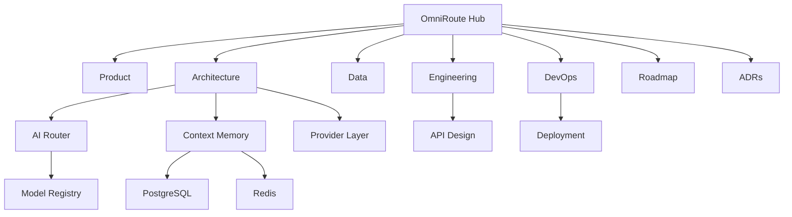

# OmniRoute Engineering Knowledge Base

#architecture #product

OmniRoute is a cross-model conversation workspace whose promise is: **your conversation stays; your AI can change**. This hub is the entry point for humans and coding agents. The authoritative input is `references/architecture-source.txt`.

## Product

- [[Product-Vision]] — users, value, boundaries, and product risks
- [[User-Flows]] — compare, select, continue, switch, and recover
- [[MVP-Scope]] — V1 commitments and explicit deferrals

## Architecture

- [[System-Architecture]] — system boundary and ownership
- [[Frontend]] and [[Backend]] — deployable application responsibilities
- [[AI-Router]] — capability-aware routing and comparison orchestration
- [[Provider-Layer]] and [[Model-Registry]] — provider isolation and configuration
- [[Context-Memory]] — branches, summaries, retrieval, and handoff
- [[Evaluation-Engine]] — quality and preference evidence
- [[Credits-Billing]] — reservation and reconciliation invariants

## Data

- [[PostgreSQL-Schema]] — durable relational state
- [[Redis]] — ephemeral coordination and streaming state
- [[Vector-Memory]] — optional pgvector-backed semantic retrieval

## Engineering

- [[API-Design]] — REST commands and multiplexed SSE
- [[Security]] — tenant, model, file, and credit boundaries
- [[Testing]] — deterministic contracts and acceptance criteria
- [[Observability]] — traces, metrics, logs, and service objectives

## DevOps

- [[Docker]] — local and production container conventions
- [[CI-CD]] — release gates and migration discipline
- [[Deployment]] — local, preview, staging, production, and growth path

## Roadmap and decisions

- [[Roadmap]] and [[Current-Sprint]]
- [[ADR-001-Monorepo]], [[ADR-002-PostgreSQL]], [[ADR-003-AI-Router]], and [[ADR-004-FastAPI-Router-Service]]

## Knowledge graph

## Open Questions

The consolidated unresolved questions are in [[Roadmap#Open Questions|Roadmap — Open Questions]]. Component-specific uncertainties remain in the relevant notes.
