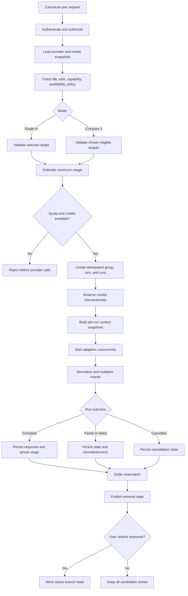

# AI Router

#architecture #ai

## Purpose

Provide a separate FastAPI/Pydantic orchestration boundary for Single AI and Compare 3 execution while keeping provider APIs outside NestJS conversation business logic. NestJS owns selection, context snapshots, durable run state, and credits. Users may select an eligible model or use deterministic Economy/Smart/Max routing. ML-based Auto Pick is explicitly later.

## Complete routing flow

## Responsibilities

- Read versioned eligibility, capabilities, pricing, and enablement from [[Model-Registry]].
- Validate selected providers rather than silently replace them.
- Create one request group and independent model runs, then fan out concurrently.
- Request provider-neutral snapshots from [[Context-Memory]].
- Invoke only [[Provider-Layer]], normalize results, and support independent cancel/retry.
- Accept only a run plan after NestJS has coordinated [[Credits-Billing]] reservation; return normalized usage and terminal events for NestJS settlement.
- Emit evaluation metadata to [[Evaluation-Engine]] without treating selection as truth.

## Inputs and outputs

Inputs: an authorized canonical request, desired mode/providers, task/file metadata, policy result, registry snapshot, and immutable context snapshot. Outputs: normalized stream events, terminal results, usage, and routing/evaluation metadata. The router does not own browser sessions or mutate canonical conversation/credit tables.

## Failure behavior

Provider failures remain isolated to their attempts. No automatic same-provider retry occurs. Automatic routing modes permit bounded fallback only for approved failure classes before visible output; explicit model choices are never silently replaced.

## Security considerations

Validate file access, provider disclosure consent, tool permissions, budget, and tenant scope before external calls. Avoid sending content to an unselected provider.

## Scalability considerations

Bound concurrency and output tokens. Use [[Redis]] for short-lived coordination, provider health, and backpressure. NestJS persists durable terminal state in PostgreSQL. Do not introduce an ML router before controlled evaluation evidence exists.

## Implementation notes

The implementation lives under `services/ai-router`. Cross-language request/event shapes originate under `packages/provider-contracts`. Routing decisions should record registry/pricing versions and reasons. The router chooses or validates targets; the provider layer translates and executes. See [[ADR-004-FastAPI-Router-Service]].

The provider registry accepts an immutable reviewed Model Registry snapshot per
execution plan and instantiates only individually enabled adapters. It does not
read provider prices or model capabilities from code, mutate conversation or
credit state, or expose credentials. See [[ADR-008-Provider-Adapter-Contract]].

### Connected deterministic routing and execution

NestJS freezes context and sends server-owned registry snapshots and the frontend
`routingMode` to authenticated `POST /routing/decisions`. FastAPI uses its own
observed health and classifies the task without an LLM call. Disabled, malformed,
region-incompatible, capability-incompatible, or context-incompatible candidates
are excluded before scoring. Required quality, suitability, latency, and exact
pricing metadata lives in the versioned registry.

- Economy chooses the exact lowest estimated cost; zero is a valid price.
- Smart weights suitability 40%, quality 25%, speed 10%, health 10%, affordability
  10%, and context headroom 5%.
- Max weights quality 60% and suitability 40%, enforcing the same eligibility,
  credit, context, and admission limits.

[[ADR-014-Multi-Provider-Routing]] defines normalization, ties, task precedence,
registry validation, and configuration. Explicit model selection overrides
ranking only after eligibility checks and disables automatic fallback.

NestJS persists the decision, reserves credits, and sends canonical plans to
`POST /providers/stream`. OpenAI, Anthropic, and Gemini stream through this same
boundary. Provider health distinguishes unobserved configuration from measured
availability and temporary failures. Router process concurrency is bounded.

Automatic modes permit up to two eligible fallback attempts before visible
output for specific availability/transport failures. Each has its own persisted
run/reservation and identical frozen context. Validation, authentication, safety,
cancellation, admission, and output-limit errors never trigger fallback. NestJS
owns fallback accounting; the legacy fallback HTTP endpoint remains disabled.
Real Compare 3 and alternatives remain disabled pending independent run/replay
and accounting acceptance. See [[ADR-013-Authenticated-Single-Provider-Execution]]
for the retained execution boundary and [[ADR-014-Multi-Provider-Routing]] for
its extension and operational limits.

## Related notes

[[ADR-003-AI-Router]] · [[API-Design]] · [[Testing]] · [[Observability]]

## Open Questions

- Which reviewed model quality/task scores and operational load limits should staging use?
- How will shared health and execution recovery coordinate multiple replicas?
