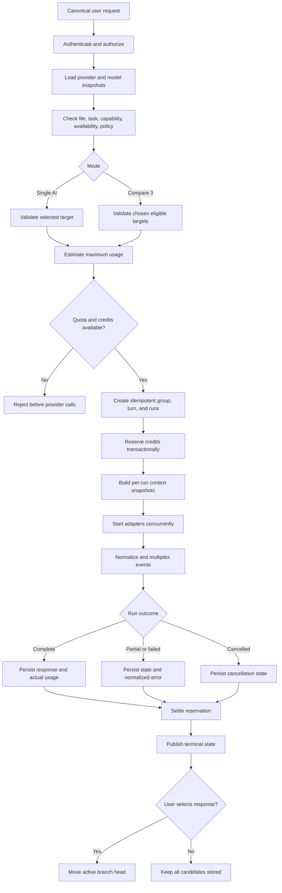

# AI Router

#architecture #ai

## Purpose

Provide a separate FastAPI/Pydantic orchestration boundary for Single AI and Compare 3 execution while keeping provider APIs outside NestJS conversation business logic. NestJS owns selection, context snapshots, durable run state, and credits. In V1, users choose providers; deterministic capability-aware ranking may assist. ML-based Auto Pick is explicitly later.

## Complete routing flow

## Responsibilities

- Read versioned eligibility, capabilities, pricing, and enablement from [[Model-Registry]].
- Validate selected providers rather than silently replace them.
- Create one request group and independent model runs, then fan out concurrently.
- Request provider-neutral snapshots from [[Context-Memory]].
- Invoke only [[Provider-Layer]], normalize results, and support independent cancel/retry.
- Accept only a run plan after NestJS has coordinated [[Credits-Billing]] reservation; return normalized usage and terminal events for NestJS settlement.
- Emit evaluation metadata to [[Evaluation-Engine]] without treating selection as truth.

## Inputs and outputs

Inputs: an authorized canonical request, desired mode/providers, task/file metadata, policy result, registry snapshot, and immutable context snapshot. Outputs: normalized stream events, terminal results, usage, and routing/evaluation metadata. The router does not own browser sessions or mutate canonical conversation/credit tables.

## Failure behavior

One provider failure does not fail its peers. Honor `Retry-After`; use bounded network/5xx retries with jitter and circuit breaking; never retry invalid requests. Automatic fallback requires prior opt-in.

## Security considerations

Validate file access, provider disclosure consent, tool permissions, budget, and tenant scope before external calls. Avoid sending content to an unselected provider.

## Scalability considerations

Bound concurrency and output tokens. Use [[Redis]] for short-lived coordination, provider health, and backpressure. NestJS persists durable terminal state in PostgreSQL. Do not introduce an ML router before controlled evaluation evidence exists.

## Implementation notes

The implementation lives under `services/ai-router`. Cross-language request/event shapes originate under `packages/provider-contracts`. Routing decisions should record registry/pricing versions and reasons. The router chooses or validates targets; the provider layer translates and executes. See [[ADR-004-FastAPI-Router-Service]].

## Related notes

[[ADR-003-AI-Router]] · [[API-Design]] · [[Testing]] · [[Observability]]

## Open Questions

- What deterministic ranking weights apply to capability, cost, latency, and availability in V1?
- Does “provider fallback” in V1 mean only user-triggered alternatives, opt-in automatic fallback, or both?
