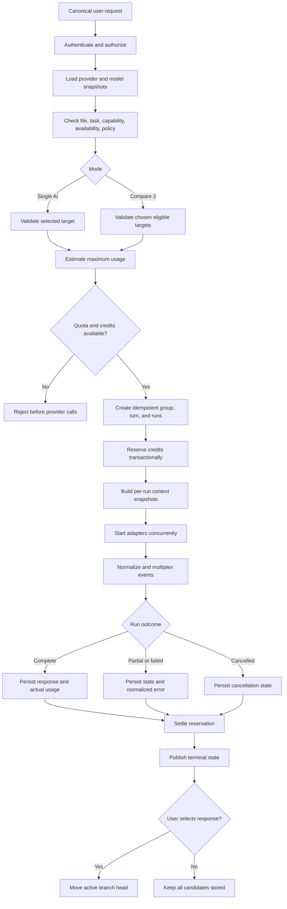

# AI Router

#architecture #ai

## Purpose

Provide a separate FastAPI/Pydantic orchestration boundary for Single AI and Compare 3 execution while keeping provider APIs outside NestJS conversation business logic. NestJS owns selection, context snapshots, durable run state, and credits. In V1, users choose providers; deterministic capability-aware ranking may assist. ML-based Auto Pick is explicitly later.

## Complete routing flow

## Responsibilities

- Read versioned eligibility, capabilities, pricing, and enablement from [[Model-Registry]].
- Validate selected providers rather than silently replace them.
- Create one request group and independent model runs, then fan out concurrently.
- Request provider-neutral snapshots from [[Context-Memory]].
- Invoke only [[Provider-Layer]], normalize results, and support independent cancel/retry.
- Accept only a run plan after NestJS has coordinated [[Credits-Billing]] reservation; return normalized usage and terminal events for NestJS settlement.
- Emit evaluation metadata to [[Evaluation-Engine]] without treating selection as truth.

## Inputs and outputs

Inputs: an authorized canonical request, desired mode/providers, task/file metadata, policy result, registry snapshot, and immutable context snapshot. Outputs: normalized stream events, terminal results, usage, and routing/evaluation metadata. The router does not own browser sessions or mutate canonical conversation/credit tables.

## Failure behavior

One provider failure does not fail its peers. Honor `Retry-After`; use bounded network/5xx retries with jitter and circuit breaking; never retry invalid requests. Automatic fallback requires prior opt-in.

## Security considerations

Validate file access, provider disclosure consent, tool permissions, budget, and tenant scope before external calls. Avoid sending content to an unselected provider.

## Scalability considerations

Bound concurrency and output tokens. Use [[Redis]] for short-lived coordination, provider health, and backpressure. NestJS persists durable terminal state in PostgreSQL. Do not introduce an ML router before controlled evaluation evidence exists.

## Implementation notes

The implementation lives under `services/ai-router`. Cross-language request/event shapes originate under `packages/provider-contracts`. Routing decisions should record registry/pricing versions and reasons. The router chooses or validates targets; the provider layer translates and executes. See [[ADR-004-FastAPI-Router-Service]].

The provider registry accepts an immutable reviewed Model Registry snapshot per
execution plan and instantiates only individually enabled adapters. It does not
read provider prices or model capabilities from code, mutate conversation or
credit state, or expose credentials. See [[ADR-008-Provider-Adapter-Contract]].

### Initial deterministic algorithm

`POST /routing/decisions` is a pure, observable rule engine. A keyword-only
Task Analyzer categorizes prompts as coding, debugging, architecture, writing,
summarization, research, reasoning, general, multimodal, or long-context. It
never calls an AI provider to make that classification.

The router first excludes disabled/unavailable providers and models that do not
meet required tools, multimodal, or context-window constraints. It ranks only
eligible versioned registry snapshots: per-task suitability scores, context
limits, latency characteristics, and token prices are registry data.

- **Economy:** strongly favors lower available estimated cost, then latency.
- **Smart:** balances reviewed task score, estimated cost, and latency.
- **Max:** favors reviewed task score and context capacity, with a small
  latency penalty.

Explicit provider/model preference is a deterministic boost. The output has a
selected target, numeric score, explanation, fallbacks, and pricing-versioned
estimate where supplied. NestJS persists it transactionally to the request
group's `routing_decisions`; FastAPI remains database-free. Missing required
capabilities or a healthy eligible model fails closed. Automatic fallback
execution still requires user opt-in.

### Resilient fallback

`/providers/fallback-stream` accepts a primary and ordered secondary execution
plans that NestJS has already authorized. It classifies timeout, HTTP, rate
limit, unavailable-model/provider, and pre-output streaming failures. It may
move to the next plan only when no useful content was emitted, fallback was
opted into, and every plan references the exact same immutable context snapshot.
The SSE stream emits `fallback.started` with the failure class and replacement
provider/model, so the main application can display and persist the transition.

An explicit user-selected model is never silently replaced: it requires both
fallback opt-in and a disclosure acknowledgement. Any output before failure is
kept as partial/billable output and ends automatic fallback. Each plan has a
distinct pre-created model run and credit reservation; the router never creates,
charges, or reconciles a reservation. NestJS stores the initial decision,
failure class, fallback decision, selected final candidate, and normalized usage
in the request group's routing snapshot, runs, and immutable usage records.

## Related notes

[[ADR-003-AI-Router]] · [[API-Design]] · [[Testing]] · [[Observability]]

## Open Questions

- What deterministic ranking weights apply to capability, cost, latency, and availability in V1?
- Does “provider fallback” in V1 mean only user-triggered alternatives, opt-in automatic fallback, or both?
