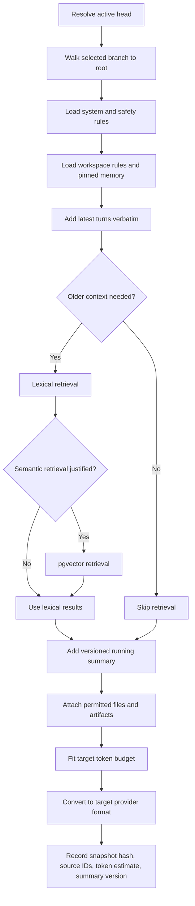

# Context and Memory

#architecture #ai

## Purpose

Assemble a provider-neutral, auditable context package from the active conversation path so a user can switch models without copying or re-explaining relevant work.

## Context assembly flow

## Responsibilities

- Resolve branches from canonical turns and selected responses.
- Layer system/safety rules, pinned memory, summaries, relevant history, recent turns, artifacts, and the new prompt.
- Exclude rejected alternatives unless the user quotes, compares, or activates them.
- Version and invalidate summaries when branches or earlier content change.
- Preserve source provenance and generate an immutable context snapshot for each run.

## Inputs and outputs

Inputs are active head, target model budget/capabilities, canonical records, memory permissions, files/artifacts, and current request. Output is a canonical context package plus snapshot metadata for provider conversion.

## Dependencies and data used

[[PostgreSQL-Schema]] stores canonical records and snapshots. [[Vector-Memory]] optionally supports semantic retrieval. [[Redis]] may cache safe summaries or token estimates. [[Model-Registry]] supplies target limits.

## Failure behavior

If retrieval or cache fails, use canonical recent history and a valid stored summary. Never silently treat an LLM summary as truth. If the safe package cannot fit or required artifacts cannot be accessed, block or explain degradation before calling the provider.

## Security considerations

Apply workspace authorization and retention policy before retrieval. Include only relevant, permitted sources; use short-lived object access and defend against prompt injection in retrieved/file content.

## Scalability considerations

Use lexical search first, pgvector only when justified, bounded token budgets, versioned summaries, asynchronous file extraction, and cache-by-snapshot hash.

## Implementation notes

Recent turns are verbatim within budget. Structured summaries record decisions, constraints, open tasks, entities, and artifact references. User-approved pinned facts outrank inferred durable memory.

## Related notes

[[AI-Router]] · [[Provider-Layer]] · [[Security]] · [[Evaluation-Engine]]

## Open Questions

- What initial token-budget allocation applies to instructions, pinned facts, summary, retrieval, recent turns, and output?
- When are summaries generated, refreshed, and retained, and which model performs summarization?
- What user controls govern pinned memory and cross-conversation/project retrieval?
