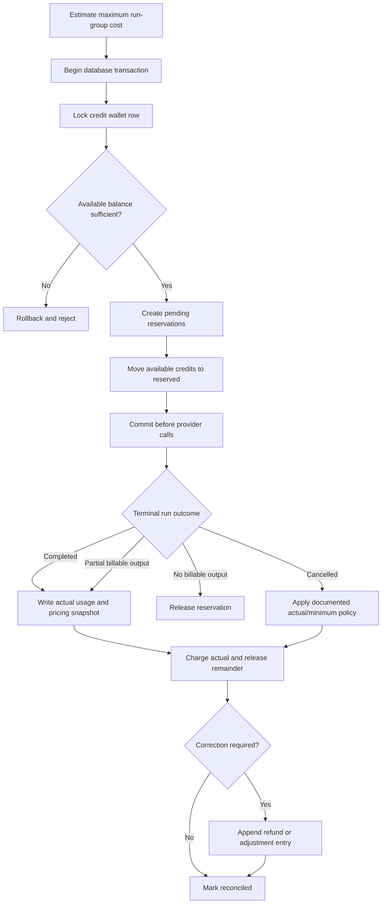

# Credits and Billing

#architecture #backend

## Purpose

Estimate costs, prevent parallel double-spend, record normalized provider usage, and maintain an auditable ledger for grants, reservations, charges, releases, and refunds.

## Reserve, settle, and refund flow



## Responsibilities

- Show an estimate range before sending and actual usage afterward.
- Reserve maximum allowed credits transactionally before external calls.
- Record immutable normalized usage and the pricing snapshot applied.
- Reconcile every terminal run idempotently and alert on aged reservations.
- Use integer minor units or exact decimal arithmetic, never binary floating point.

## Inputs and outputs

Inputs are [[Model-Registry]] pricing/capabilities, token estimates, normalized provider usage, run outcome, and policy. Outputs are wallet balances, immutable ledger entries, usage summaries, and reconciliation telemetry.

## Dependencies and data used

[[PostgreSQL-Schema]] is authoritative; [[Redis]] may rate-limit or cache estimates but never owns balances. [[AI-Router]] coordinates reserve-before-call and terminal settlement.

## Failure behavior

Fail closed when reservation or reconciliation state is uncertain. Use idempotency keys and a background reconciler. A provider failure before meaningful output releases funds; partial billable usage follows a transparent policy.

## Security considerations

Authorize wallet access, audit manual adjustments, isolate pricing administration, avoid trusting client estimates, and rate-limit cost-incurring operations.

## Scalability considerations

Keep transactions short, lock a narrowly scoped wallet row, index request-group/run identifiers, and partition high-volume immutable events only after measured need.

## Implementation notes

A ledger supplements a cached wallet projection; it is not replaced by a mutable counter. Compare mode reserves per run or an equivalent auditable group total before fan-out.

The MVP uses integer platform credits (`BIGINT`) and Model Registry USD decimal
strings. `PLATFORM_CREDITS_PER_USD` converts an exact Prisma decimal cost to
credits by rounding up; binary floating point is never used. A UTC daily grant
is an idempotent `GRANT` ledger entry keyed as `daily-free:YYYY-MM-DD`.

Before a model run begins, the usage module grants the daily allowance if due,
then locks the wallet and reserves the registry-based maximum input/output
cost. A terminal success records final normalized provider usage and its exact
registry pricing snapshot in the same serializable transaction as settlement.
Settlement appends a `CHARGE` for actual credits plus a `RELEASE` for any
remainder. Cancellation and pre-output failure release the full reservation;
retrying a terminal reconciliation returns the settled wallet without a second
ledger movement.

## Production reconciliation and interruption recovery

`CreditReservation` has one terminal lifecycle: `PENDING` means the exact
maximum charge is reserved, `SETTLED` means actual normalized usage was charged,
and `RELEASED` means the full reservation was returned. The append-only ledger
contains a reservation movement and then exactly one terminal charge/release
combination. Database uniqueness on wallet/idempotency keys and serializable
wallet-row locking make repeated reserve, settle, release, and reconciliation
calls converge without double charging or refunding.

NestJS writes `dispatched: true` durably before opening an upstream provider
stream. A stale reservation that was never dispatched is released. A dispatched
run with complete normalized input/output usage is settled from the run's exact
immutable registry entry. A dispatched run with missing trustworthy usage stays
`reconciliation_required`: it is neither refunded nor treated as free. A
completed response may therefore be visible while its accounting remains
pending. If calculated actual credits exceed the maximum reservation, the wallet
is never overdrafted; settlement stays pending for operator review.

Every final usage event stores the provider/model, registry version, pricing
version, and pricing JSON used for the charge. A later registry revision cannot
change the cost of an old run. Explicit zero prices are valid: usage evidence is
recorded, no reservation is needed, and no synthetic charge is created.

Compare 3, Try Another AI, and fallback runs each own a separate `ModelRun` and
reservation. Compare setup reserves every child before dispatching any child;
if a child cannot reserve, no provider call starts and earlier reservations are
released. Fallback attempts retain their own provider/run/usage evidence and
never reuse or charge the failed attempt's reservation.

The guarded operator command scans at most 200 stale reservations per
invocation and prints only safe counts. It does not call providers or read
prompts:

```sh
CREDIT_RECONCILE_CONFIRM=reconcile-stale-credit-reservations \
CREDIT_RECONCILE_BATCH=50 \
DATABASE_URL='…' \
pnpm --filter @omniroute/api credits:reconcile
```

It is safe to repeat. Scheduling and alert policy, plus a manual policy for a
provider charge proven to exceed its reservation, remain operating work.

## Related notes

[[API-Design]] · [[Security]] · [[Testing]] · [[Observability]]

## Open Questions

- What is the exact credit unit and provider-price-to-credit conversion policy?
- What minimum charge, if any, applies to partial output and user cancellation?
- Are reservations per model run, per request group, or both with a defined parent/child ledger relationship?
