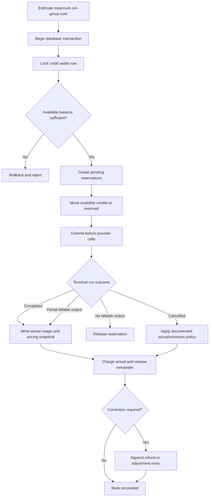

# Credits and Billing

#architecture #backend

## Purpose

Estimate costs, prevent parallel double-spend, record normalized provider usage, and maintain an auditable ledger for grants, reservations, charges, releases, and refunds.

## Reserve, settle, and refund flow

## Responsibilities

- Show an estimate range before sending and actual usage afterward.
- Reserve maximum allowed credits transactionally before external calls.
- Record immutable normalized usage and the pricing snapshot applied.
- Reconcile every terminal run idempotently and alert on aged reservations.
- Use integer minor units or exact decimal arithmetic, never binary floating point.

## Inputs and outputs

Inputs are [[Model-Registry]] pricing/capabilities, token estimates, normalized provider usage, run outcome, and policy. Outputs are wallet balances, immutable ledger entries, usage summaries, and reconciliation telemetry.

## Dependencies and data used

[[PostgreSQL-Schema]] is authoritative; [[Redis]] may rate-limit or cache estimates but never owns balances. [[AI-Router]] coordinates reserve-before-call and terminal settlement.

## Failure behavior

Fail closed when reservation or reconciliation state is uncertain. Use idempotency keys and a background reconciler. A provider failure before meaningful output releases funds; partial billable usage follows a transparent policy.

## Security considerations

Authorize wallet access, audit manual adjustments, isolate pricing administration, avoid trusting client estimates, and rate-limit cost-incurring operations.

## Scalability considerations

Keep transactions short, lock a narrowly scoped wallet row, index request-group/run identifiers, and partition high-volume immutable events only after measured need.

## Implementation notes

A ledger supplements a cached wallet projection; it is not replaced by a mutable counter. Compare mode reserves per run or an equivalent auditable group total before fan-out.

## Related notes

[[API-Design]] · [[Security]] · [[Testing]] · [[Observability]]

## Open Questions

- What is the exact credit unit and provider-price-to-credit conversion policy?
- What minimum charge, if any, applies to partial output and user cancellation?
- Are reservations per model run, per request group, or both with a defined parent/child ledger relationship?
