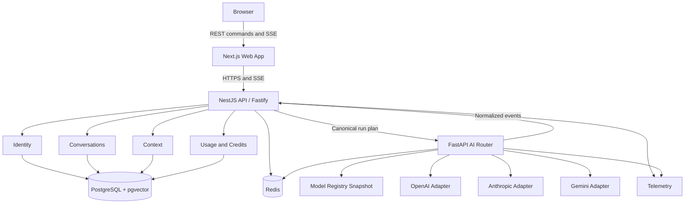

# System Architecture

#architecture

## Purpose

OmniRoute starts as a modular monolith with independently testable provider adapters and background workers. The platform owns state; providers are replaceable inference engines.

## Responsibilities

- [[Frontend]] owns the consistent user experience and presentation state.
- [[Backend]] owns identity, conversations, context, usage, files, policy, analytics, durable run state, and client-facing streaming boundaries.
- [[AI-Router]] is a separate FastAPI service that orchestrates comparisons and eligibility; [[Provider-Layer]] alone imports provider SDKs.
- [[Context-Memory]] owns provider-neutral branch resolution and context packages.
- [[PostgreSQL-Schema]] owns durable history and money-like invariants.
- [[Redis]] accelerates ephemeral coordination but never becomes the only copy of a selected branch or credit transaction.
- Object storage holds file bytes and large artifacts; PostgreSQL stores their metadata.

## Inputs and outputs

Inputs are authenticated REST commands, file-upload intents, selections, switches, cancellations, and provider stream events. Outputs are REST representations, normalized SSE events, signed object access, durable records, and telemetry.

## Failure behavior

Provider calls fail independently. Durable state remains recoverable when Redis or an SSE connection fails. Credit uncertainty fails closed, terminal runs are reconciled, and background tasks are idempotent.

## Security considerations

Enforce workspace authorization at every boundary, keep secrets server-side, use short-lived signed object URLs, and never execute model output directly. See [[Security]].

## Scalability considerations

Scale the web, API, and AI Router deployables independently. Additional extraction still requires measured need. Kubernetes, Kafka, a service mesh, and multi-region active-active are deferred.

## Implementation notes

The Phase 1 stack is Next.js 16/React 19 and NestJS 12/Fastify on Node.js 24 LTS, plus FastAPI/Pydantic on Python 3.12 or newer. PostgreSQL 18 with pgvector is durable storage and Redis 8 is ephemeral coordination. Provider SDKs and product persistence are intentionally not implemented in Phase 1. See [[ADR-004-FastAPI-Router-Service]].

## Related notes

[[ADR-001-Monorepo]] · [[ADR-002-PostgreSQL]] · [[API-Design]] · [[Deployment]] · [[Observability]]

## Open Questions

- Which managed API/worker host and which managed data vendors will be used for MVP?
- When do background jobs justify adding the deferred worker deployable?
