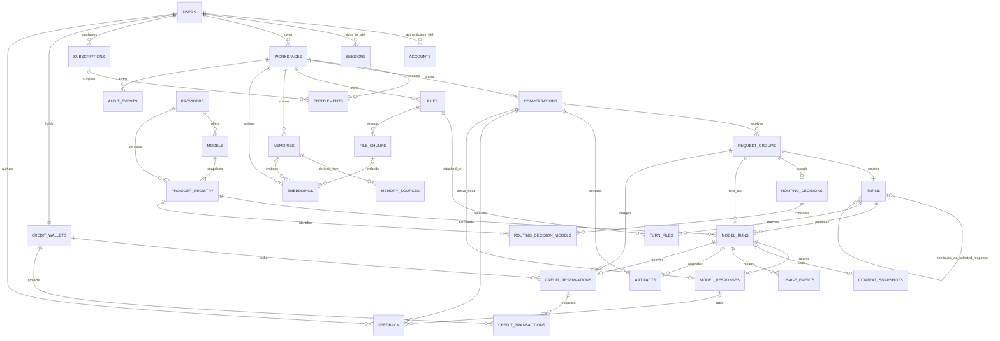
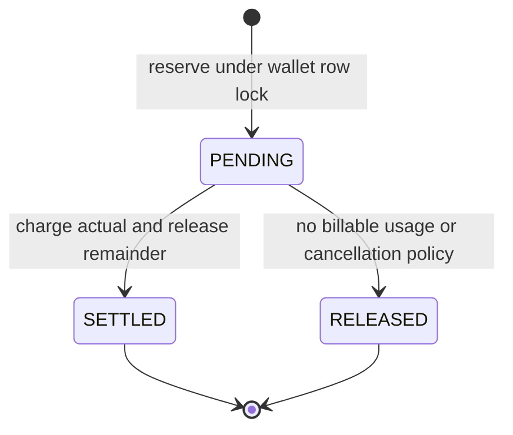

# Database Diagram

#database #architecture

This diagram describes the Phase 2 PostgreSQL schema. `turns.user_content` and
`model_responses.content` are the provider-neutral canonical message records;
provider request and response formats do not enter the conversation tables.
The MVP conversation flow creates the request group, routing decision, model
run, and per-run context snapshot before streaming begins; the diagram therefore
also captures the persisted model-selection and routing metadata.

## Accounting lifecycle

Every state transition updates the wallet projection and appends a
`credit_transactions` entry in one serializable transaction. Ledger entries
cannot be updated or deleted.

## Related notes

[[PostgreSQL-Schema]] · [[Credits-Billing]] · [[Vector-Memory]] ·
[[ADR-005-Core-Data-Model]]
