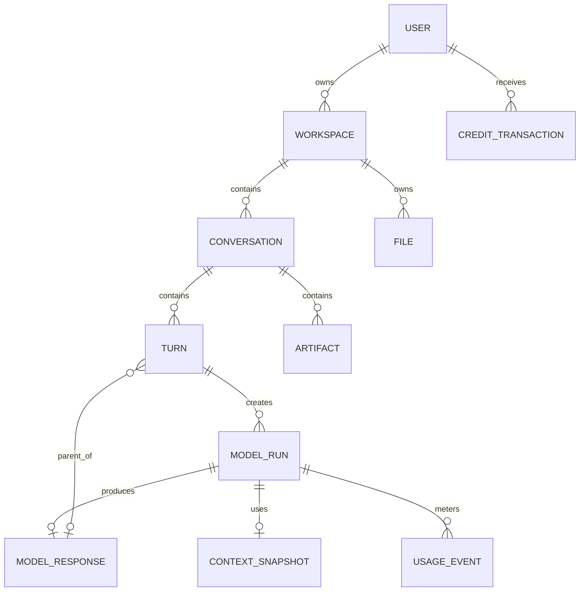

# PostgreSQL Schema

#database #architecture

## Purpose

PostgreSQL 18 is the primary system of record for identity, workspaces, conversation branches, context provenance, file metadata, provider configuration, usage, and credits. Local Phase 1 infrastructure enables pgvector, but semantic retrieval remains deferred until justified.

## Core entities

| Entity                | Key fields                                                                  | Purpose                                  |
| --------------------- | --------------------------------------------------------------------------- | ---------------------------------------- |
| `users`               | `id`, `email`, `name`, `status`, `created_at`                               | account lifecycle                        |
| `workspaces`          | `id`, `owner_id`, `plan`, `retention_policy`                                | tenant and policy boundary               |
| `conversations`       | `id`, `workspace_id`, `title`, `active_head_id`, `mode`                     | chat and active branch pointer           |
| `turns`               | `id`, `conversation_id`, `parent_response_id`, `user_content`, `created_at` | user input anchored to prior selection   |
| `model_runs`          | `id`, `turn_id`, `provider`, `model_key`, `status`, `request_group_id`      | external request lifecycle               |
| `model_responses`     | `id`, `run_id`, `content`, `selected_at`, `finish_reason`                   | persistent candidate                     |
| `context_snapshots`   | `id`, `run_id`, `summary_version`, `source_ids`, `token_estimate`           | handoff provenance                       |
| `files`               | `id`, `workspace_id`, `object_key`, `mime`, `size`, `scan_status`           | object metadata and access boundary      |
| `artifacts`           | `id`, `conversation_id`, `type`, `object_key`, `source_run_id`              | reusable generated output                |
| `usage_events`        | `id`, `run_id`, `provider_usage`, `price_snapshot`, `actual_cost`           | immutable metering                       |
| `credit_transactions` | `id`, `user_id`, `request_group_id`, `amount`, `type`, `status`             | grants/reserves/charges/releases/refunds |
| `provider_registry`   | `provider`, `model_key`, `capabilities`, `pricing_version`, `enabled`       | versioned model configuration            |

Phase 2 preserves those canonical names and adds the supporting relations needed
to make the MVP enforceable:

- `accounts` stores external identity references and `sessions` stores only a
  one-way session token hash; neither contains OAuth tokens or provider secrets.
- `request_groups`, `routing_decisions`, and `routing_decision_models` make
  idempotency and the routing plan durable before any future provider call.
- `providers`, `models`, and versioned `provider_registry` rows form the model
  registry abstraction. Runs reference the exact registry row used.
- `credit_wallets` is a user-scoped, lockable balance projection;
  `credit_reservations` owns per-run lifecycle state; `credit_transactions` is
  the append-only ledger.
- `subscriptions` and typed `entitlements` represent commercial state without
  storing payment credentials.
- `file_chunks`, `memories`, `memory_sources`, and `embeddings` retain provenance
  and workspace scope. MVP text chunks use a 64-dimensional pgvector value;
  summary source hashes version deterministic summaries when the selected path
  changes.
- `feedback` and `audit_events` store scoped product signals and sensitive-state
  audit metadata without duplicating raw prompt content.

See [[Database-Diagram]] for the complete Phase 2 relationship diagram.

## Relationships and invariants

- One idempotency key per user/logical request group.
- At most one active selected response per turn, enforced by a partial unique index.
- Foreign keys connect runs to turns and responses to runs.
- Cross-table triggers ensure request groups, turns, active heads, model registry
  snapshots, and credit records remain in the same owner/workspace/conversation scope.
- Required indexes include conversation/time, turn/provider, user/time, request
  group, active reservations, and enabled registry entries.
- JSONB is limited to provider metadata and versioned snapshots, not general relational state.
- Credit balances cannot be negative, reservation settlement cannot exceed the
  reserved amount, and ledger rows cannot be updated or deleted.

## Inputs and outputs

Repositories receive validated domain commands and write transactional state. Read models provide canonical data to [[Backend]], [[Context-Memory]], and [[API-Design]].

## Failure behavior

Transactions protect branch movement and credits. Migrations follow expand-migrate-contract. Backups must be restorable; Redis loss must not lose durable business state.

## Security and scalability

Scope every query by workspace, audit sensitive state changes, encrypt in transit/at rest, and implement retention/export/deletion. Add indexes from measured queries; use read replicas, partitioning, or pgvector indexes only when justified.

## Related notes

[[ADR-002-PostgreSQL]] · [[ADR-005-Core-Data-Model]] · [[Database-Diagram]] · [[Redis]] · [[Vector-Memory]] · [[Credits-Billing]] · [[CI-CD]]

## Open Questions

- Which content uses soft deletion versus hard deletion under retention policy?
- What production retention periods apply to immutable usage, ledger, feedback,
  and audit records?
