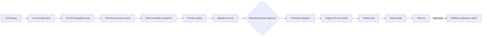

# CI/CD

#devops

## Purpose

Build, verify, scan, preview, migrate, deploy, smoke-test, observe, and safely roll back OmniRoute through GitHub Actions and infrastructure-as-code.

## Pipeline

## Implemented CI gates

`.github/workflows/ci.yml` runs independent GitHub Actions jobs for linting
(including Python formatting), TypeScript/Python type checks, frontend tests,
backend unit tests, AI Router tests, and PostgreSQL-backed migration and
integration tests. The final build job depends on all gates, validates the
Compose configuration, builds every deployable, and validates all production
Dockerfiles.

The integration job applies Prisma migrations to an isolated `omniroute_test`
PostgreSQL service, verifies migration status, then executes integration tests.
Production deployment is intentionally not encoded until a container registry,
hosting provider, deployment credentials, approval environment, and rollback
owner are selected.

## Responsibilities

- Pin toolchains and dependencies; cache without bypassing correctness.
- Run deterministic test gates from [[Testing]] and bounded provider smoke tests separately.
- Build/sign/scan immutable images and retain provenance/SBOM.
- Create production-free, short-retention, spend-capped previews.
- Rehearse migrations and use expand-migrate-contract for breaking schema changes.
- Require explicit production approval, then observe release health.

## Inputs and outputs

Inputs are commits, workflow definitions, lockfiles, migration files, IaC, test fixtures, and environment secrets. Outputs are checks, preview URLs, signed images, migration evidence, deployments, and release records.

## Dependencies

[[Docker]], [[Deployment]], [[PostgreSQL-Schema]], [[Security]], and [[Observability]].

## Failure behavior

Stop on failed gates. Do not roll back a non-backward-compatible schema blindly; use compatible application rollback and forward-fix or explicitly designed migration recovery.

## Security considerations

Use least-privilege short-lived CI credentials, protected environments, branch protections, secret scanning, dependency scanning, signed artifacts, and no production data in previews.

## Scalability considerations

Parallelize independent checks, shard only measured slow suites, and keep deployment concurrency locked per environment.

## Open Questions

- Which IaC tool and artifact/container registry will be used?
- What branch protection, approver, preview, and rollback policies are required?
