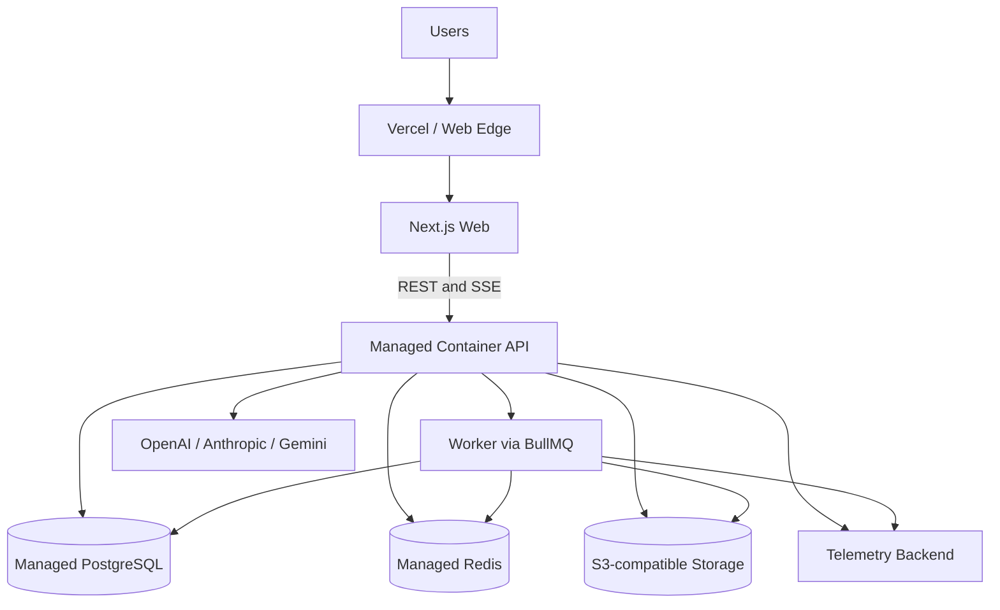

# Deployment

#devops #architecture

## Purpose

Define a low-operations MVP deployment with a measured path to larger container infrastructure.

## Infrastructure flow

## Environments

| Environment | Purpose | Data rule |
|---|---|---|
| Local | Compose dependencies and provider mocks | synthetic data; developer keys in secret storage |
| Preview | per-PR web/API validation | no production data; short retention; low spend caps |
| Staging | migration rehearsal, load, provider smoke tests | production-like schema; sanitized data |
| Production | real users and billing | encrypted, audited, backed up, retention-controlled |

## Deployment path

- MVP: Vercel web; Railway, Render, Fly.io, or another managed container API/worker; managed PostgreSQL/Redis/object storage.
- Growth: Vercel/CDN web; AWS ECS/Fargate or equivalent; RDS, managed Redis, S3, and queue.
- Large scale: multi-region edge plus Kubernetes/mature containers only if justified; replicas, partitioning, regional storage, and disaster recovery.

## Inputs and outputs

Inputs are approved [[CI-CD]] artifacts, migrations, typed environment config, and managed service credentials. Outputs are web/API/worker releases, health signals, and reversible application deployments.

## Failure behavior

Use health checks, rollback on release regression, fail closed on credit uncertainty, retain durable state through process loss, and document provider/dependency degradation. Test PostgreSQL restore and object lifecycle/deletion.

## Security considerations

Keep secrets in platform/cloud managers, isolate networks, encrypt transport/storage, separate environments, restrict operator access, and prohibit production data in previews.

## Scalability considerations

Scale API and workers independently. Add replicas, partitioning, regions, or orchestration only from measured latency, traffic, compliance, or operational needs.

## Related notes

[[System-Architecture]] · [[Docker]] · [[Observability]] · [[Security]] · [[Roadmap]]

## Open Questions

- Which MVP container, PostgreSQL, Redis, object-storage, DNS, and telemetry vendors are selected?
- What regions, recovery objectives, backup schedule, and data residency constraints apply?
- Does the chosen API host reliably support long-lived SSE and graceful deploy draining?
