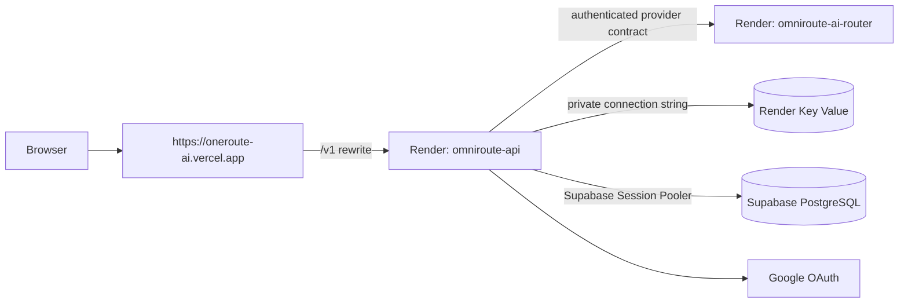

# Render production deployment

#devops #deployment #render

## Purpose

Deploy the OmniRoute NestJS API and FastAPI AI Router as separate Render Docker
web services in Singapore. PostgreSQL remains on Supabase; Render Key Value is
the ephemeral cache only. The root [render.yaml](../../render.yaml) is the
source of truth for these Render resources.

## Architecture

The browser only calls `https://oneroute-ai.vercel.app/v1/...`. Vercel forwards
those requests to the Render API service. The Render API URL is server/build
configuration and must never be exposed as a `NEXT_PUBLIC_*` value.

`omniroute-cache` allows no public IP addresses, uses `allkeys-lru`, and has
persistence disabled. The Blueprint declares no Render Postgres resource and no
migration command; Supabase migrations are already production schema state.

## Blueprint wiring

The API and AI Router use the repository root as the Docker build context. This
is required because `infrastructure/docker/api.Dockerfile` builds the API with
its workspace packages.

| Consumer | Variable | Source |
| --- | --- | --- |
| API | `REDIS_URL` | `omniroute-cache` private `connectionString` |
| API | `AI_ROUTER_URL` | `omniroute-ai-router` `RENDER_EXTERNAL_URL` service reference |
| API and AI Router | `AI_ROUTER_INTERNAL_TOKEN` | Render-generated API secret, copied to the router |
| API | `AUTH_SESSION_SECRET` | Render-generated 256-bit secret |

`WEB_APP_URL`, `CORS_ORIGIN`, and `API_PUBLIC_URL` are all committed Blueprint
values set to `https://oneroute-ai.vercel.app`. `AUTH_COOKIE_DOMAIN` is absent:
the application emits host-only session cookies. The Render service still listens
on its own Render URL for Vercel's rewrite target and for health checks.

## Render values to enter

The first Blueprint sync prompts only for these API values:

| Variable | Required value |
| --- | --- |
| `DATABASE_URL` | Supabase **Session Pooler** URI for production, including Supabase's required TLS query parameter |
| `GOOGLE_CLIENT_ID` | Production Google OAuth web-client ID |
| `GOOGLE_CLIENT_SECRET` | Matching production Google OAuth client secret |

Do not add `AUTH_COOKIE_DOMAIN`. Do not enter provider keys yet; provider
adapters remain disabled until their credentials and reviewed registry entries
are ready.

## Vercel and Google configuration

Vercel Production environment variables:

| Variable | Value | Visibility |
| --- | --- | --- |
| `NEXT_PUBLIC_API_URL` | `https://oneroute-ai.vercel.app` | Public browser build value |
| `RENDER_API_ORIGIN` | `https://<actual-render-api>.onrender.com` | Server/build only; never prefix with `NEXT_PUBLIC_` and do not append `/v1` |

Rebuild Vercel after changing either value. The Google OAuth authorized redirect
URI is:

`https://oneroute-ai.vercel.app/v1/auth/google/callback`

Vercel transparently proxies that callback to Render. Do not register the Render
hostname as the Google callback or use it as a browser API origin.

## Health checks and ports

| Service | Render health check | Process binding |
| --- | --- | --- |
| `omniroute-api` | `/v1/health/ready` | `API_HOST=0.0.0.0`, `API_PORT=4000`, `PORT=4000` |
| `omniroute-ai-router` | `/health/ready` | `AI_ROUTER_HOST=0.0.0.0`, `AI_ROUTER_PORT=8001`, `PORT=8001` |

No Dockerfile change is needed. The API image starts NestJS using `API_PORT`,
and the router image starts Uvicorn using `AI_ROUTER_PORT`; both match their
configured Render `PORT` values.

## Deploy and troubleshoot

1. Push the reviewed Blueprint and application changes.
2. In Render, select **New > Blueprint**, connect `rishabh-git88/omniroute`,
   select the branch, and use `render.yaml`.
3. Enter the three prompted values above. Confirm that exactly two web services
   and one Key Value instance will be created. Do not add Render PostgreSQL or a
   Prisma pre-deploy command.
4. Copy the assigned `omniroute-api` Render HTTPS URL into Vercel as
   `RENDER_API_ORIGIN`; set `NEXT_PUBLIC_API_URL` to the Vercel origin and
   redeploy Vercel.
5. Add the Vercel callback URL to the Google OAuth client, then verify
   `https://oneroute-ai.vercel.app/v1/health` and Google sign-in.

If `/v1` returns a Vercel 404 or 502, verify `RENDER_API_ORIGIN` is an HTTPS
origin with no path or `/v1` suffix and redeploy Vercel. If API readiness fails,
verify the Supabase Session Pooler URL and TLS requirements. If API startup fails
environment validation, make all three public API/web/CORS values exactly
`https://oneroute-ai.vercel.app` and leave `AUTH_COOKIE_DOMAIN` unset.

## Related notes

[[Deployment]] · [[Docker]] · [[CI-CD]] · [[Authentication]] · [[Redis]] ·
[[ADR-015-Vercel-Same-Origin-API-Proxy]]
