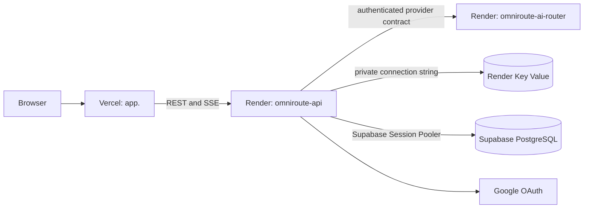

# Render production deployment

#devops #deployment #render

## Purpose

Deploy the OmniRoute NestJS API and FastAPI AI Router as separate Render Docker
web services in Singapore. PostgreSQL remains on Supabase; Render Key Value is
the ephemeral cache only. The root [render.yaml](../../render.yaml) is the
source of truth for these Render resources.

## Architecture

`omniroute-cache` allows no public IP addresses, has `allkeys-lru` eviction,
and has persistence disabled. It must only hold loss-tolerant ephemeral data.
The Blueprint does not declare a Render Postgres resource or a migration command:
the Supabase migrations are already the source of production schema state.

## Blueprint wiring

The API and AI Router use the repository root as the Docker build context. This
is required because `infrastructure/docker/api.Dockerfile` builds the API with
its workspace packages (`packages/config`, `packages/provider-contracts`, and
`packages/types`).

| Consumer | Variable | Source |
| --- | --- | --- |
| API | `REDIS_URL` | `omniroute-cache` private `connectionString` |
| API | `AI_ROUTER_URL` | `omniroute-ai-router` `RENDER_EXTERNAL_URL` service reference |
| API and AI Router | `AI_ROUTER_INTERNAL_TOKEN` | Render-generated API secret, copied to the router |
| API | `AUTH_SESSION_SECRET` | Render-generated 256-bit secret |

Render supplies `RENDER_EXTERNAL_URL` for every web service. It is used for the
router reference. It cannot safely be used as the API's `API_PUBLIC_URL`: the
current production validation requires an owned sibling-domain pair,
`https://app.<domain>` and `https://api.<domain>`, and a shared
`AUTH_COOKIE_DOMAIN=<domain>`. An `onrender.com` API host and a Vercel host do
not meet that cookie contract. Keep the validation intact and enter the custom
API origin in Render.

## Values to enter in Render

The first Blueprint sync prompts for every `sync: false` API variable:

| Variable | Required value |
| --- | --- |
| `DATABASE_URL` | Supabase **Session Pooler** URI for production, including the required TLS query parameter supplied by Supabase |
| `GOOGLE_CLIENT_ID` | Production Google OAuth web-client ID |
| `GOOGLE_CLIENT_SECRET` | Matching production Google OAuth client secret |
| `WEB_APP_URL` | `https://app.<domain>` served by Vercel |
| `CORS_ORIGIN` | Exactly the same origin as `WEB_APP_URL` |
| `API_PUBLIC_URL` | `https://api.<domain>` custom domain attached to `omniroute-api` |
| `AUTH_COOKIE_DOMAIN` | `<domain>` without a scheme; it must contain both `app` and `api` hosts |

Do not enter provider keys yet. The Blueprint sets all three provider adapters
to disabled and sets `AI_EXECUTION_PROVIDER=disabled`; enable a provider only
after its credentials and reviewed registry configuration are available.

## Required DNS, Vercel, and Google configuration

1. Choose an owned parent domain and create `app.<domain>` in Vercel and
   `api.<domain>` on the Render API service. Complete the DNS records requested
   by each platform before setting the related origins.
2. In Vercel Production environment variables, set
   `NEXT_PUBLIC_API_URL=https://api.<domain>` and redeploy the web app. This is
   a build-time public value, not a Render setting.
3. In Google Cloud Console, add exactly
   `https://api.<domain>/v1/auth/google/callback` to the OAuth client's
   authorized redirect URIs. Use the same client ID and secret in Render.
4. Never use the Render `onrender.com` API URL as an OAuth callback or production
   cookie domain for this application.

## Health checks and ports

| Service | Render health check | Process binding |
| --- | --- | --- |
| `omniroute-api` | `/v1/health/ready` | `API_HOST=0.0.0.0`, `API_PORT=4000`, `PORT=4000` |
| `omniroute-ai-router` | `/health/ready` | `AI_ROUTER_HOST=0.0.0.0`, `AI_ROUTER_PORT=8001`, `PORT=8001` |

No Dockerfile change is needed. The API image starts NestJS using `API_PORT`,
and the router image starts Uvicorn using `AI_ROUTER_PORT`; each is explicitly
set to its Render `PORT` value. API readiness additionally verifies the Supabase
connection, while liveness at `/v1/health` is process-only.

## Deploy and troubleshoot

1. Push the reviewed `render.yaml` to the deployment branch.
2. In Render, select **New > Blueprint**, connect `rishabh-git88/omniroute`,
   select the deployment branch, and keep the Blueprint path as `render.yaml`.
3. Enter the seven prompted values above, review that exactly two web services
   and one Key Value instance will be created, then deploy. Do not add Render
   PostgreSQL or a Prisma pre-deploy command.
4. Attach `api.<domain>` to `omniroute-api`, configure Vercel's `app.<domain>`,
   then verify `https://api.<domain>/v1/health` and
   `https://api.<domain>/v1/health/ready` return 200.
5. Add the Google callback, redeploy the API after saving the environment values,
   and test Google sign-in from the Vercel production URL.

If API readiness fails, first verify the Session Pooler URL (not a local,
direct, or committed connection string) and Supabase's TLS requirement. If API
startup reports environment validation errors, compare all four sibling-domain
values exactly; `WEB_APP_URL` and `CORS_ORIGIN` must be identical. If router
calls fail, confirm both services are in the same Blueprint/environment and
that their generated `AI_ROUTER_INTERNAL_TOKEN` values are wired, not manually
replaced. If the free services are asleep, allow the initial request to wake
both services before treating it as an application failure.

## Related notes

[[Deployment]] · [[Docker]] · [[CI-CD]] · [[Authentication]] · [[Redis]] ·
[[Security]]

## Open Questions

- Which owned parent domain will provide the required `app` and `api` sibling
  hosts for production?
- When provider credentials are added, which adapters and registry entries are
  approved for the first live execution rollout?
