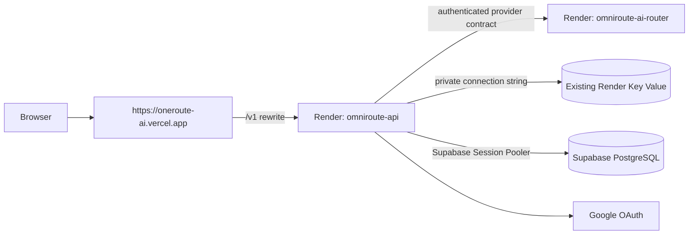

# Render production deployment

#devops #deployment #render

## Purpose

Deploy the OmniRoute NestJS API and FastAPI AI Router as separate Render Docker
web services in Singapore. PostgreSQL remains on Supabase; an existing Render
Key Value instance is the ephemeral cache only. Render allows one Free Key Value
instance per workspace, so the Blueprint deliberately declares no Key Value
resource. The root [render.yaml](../../render.yaml) is the source of truth for
the two web services.

## Architecture



The browser only calls `https://oneroute-ai.vercel.app/v1/...`. Vercel forwards
those requests to the Render API service. The Render API URL is server/build
configuration and must never be exposed as a `NEXT_PUBLIC_*` value.

The existing Key Value instance must remain private, cache-only, and configured
with the workspace's appropriate eviction policy. OmniRoute uses Redis only for
ephemeral cache, queue, and real-time coordination state; Supabase PostgreSQL
remains the persistent system of record. The Blueprint declares no Render
Postgres resource and no migration command; Supabase migrations are already
production schema state.

## Blueprint wiring

The API and AI Router use the repository root as the Docker build context. This
is required because `infrastructure/docker/api.Dockerfile` builds the API with
its workspace packages.

| Consumer | Variable | Source |
| --- | --- | --- |
| API | `REDIS_URL` | Manual secret: existing Render Key Value private connection string |
| API | `AI_ROUTER_URL` | `omniroute-ai-router` `RENDER_EXTERNAL_URL` service reference |
| API and AI Router | `AI_ROUTER_INTERNAL_TOKEN` | Render-generated API secret, copied to the router |
| API | `AUTH_SESSION_SECRET` | Render-generated 256-bit secret |

`WEB_APP_URL`, `CORS_ORIGIN`, and `API_PUBLIC_URL` are all committed Blueprint
values set to `https://oneroute-ai.vercel.app`. `AUTH_COOKIE_DOMAIN` is absent:
the application emits host-only session cookies. The Render service still listens
on its own Render URL for Vercel's rewrite target and for health checks.

## Render values to enter

The Blueprint sync prompts for these API values:

| Variable | Required value |
| --- | --- |
| `DATABASE_URL` | Supabase **Session Pooler** URI for production, including Supabase's required TLS query parameter |
| `GOOGLE_CLIENT_ID` | Production Google OAuth web-client ID |
| `GOOGLE_CLIENT_SECRET` | Matching production Google OAuth client secret |
| `REDIS_URL` | Private connection string from the existing Render Key Value instance |
| `GEMINI_API_KEY` | Gemini API key, entered only on `omniroute-ai-router` |
| `GROQ_API_KEY` | Groq API key, entered only on `omniroute-ai-router` |
| `OPENROUTER_API_KEY` | OpenRouter API key, entered only on `omniroute-ai-router` |
| `OPENAI_API_KEY` | Optional future OpenAI project key, entered only on `omniroute-ai-router` |

Do not create a second Free Key Value instance. Copy the existing instance's
internal/private connection string into `REDIS_URL`; never commit or expose it.
Do not add `AUTH_COOKIE_DOMAIN`. OpenAI and Anthropic are disabled in this
development Blueprint and their absent keys do not block router startup. Gemini,
Groq, and OpenRouter are enabled only at the adapter layer; a reviewed registry
entry still controls whether any model can execute.

## Development provider activation

The Blueprint configures `AI_EXECUTION_PROVIDER=multi` on the API, while the AI
Router enables Gemini, Groq, and OpenRouter. Enter only their keys on the AI
Router service; never add a provider key to Vercel or the NestJS API service.
OpenAI and Anthropic remain first-class source support but are disabled until
their paid credentials are intentionally supplied.

[`config/model-registry/openai-gpt-5-mini-v1.json`](../../config/model-registry/openai-gpt-5-mini-v1.json)
and the Gemini, Groq, and OpenRouter candidate files record documented model
identity, text limits, and provider/API pricing. Their importer creates entries
disabled. Gemini's developer free quota is not represented as an artificial zero
provider price; the concrete OpenRouter `:free` candidate is zero only because
OpenRouter documents that endpoint as zero priced. Before activation, an
authorized operator must add internally reviewed `taskScores`, `qualityScore`,
and `typicalLatencyMs` to a new immutable registry version. This prevents
unmeasured routing metadata from enabling traffic.

From a trusted operator machine with the Supabase production `DATABASE_URL`, run
the explicit administrative import after reviewing the JSON file. The command
does not print the connection string or provider key:

```bash
MODEL_REGISTRY_ADMIN_CONFIRM=approve-reviewed-registry-import \
MODEL_REGISTRY_SEED_FILE=config/model-registry/openai-gpt-5-mini-v1.json \
pnpm --filter @omniroute/api db:manage:registry
```

After adding approved routing metadata in a new registry version, rerun with
`MODEL_REGISTRY_ACTIVATE=true` to enable the provider and its `GENERAL` rollout.
Run a production smoke manually only after Render has the relevant provider key.
No live provider test runs in CI.

## Vercel and Google configuration

Vercel Production environment variables:

| Variable | Value | Visibility |
| --- | --- | --- |
| `NEXT_PUBLIC_API_URL` | `https://oneroute-ai.vercel.app` | Public browser build value |
| `RENDER_API_ORIGIN` | `https://<actual-render-api>.onrender.com` | Server/build only; never prefix with `NEXT_PUBLIC_` and do not append `/v1` |

Rebuild Vercel after changing either value. The Google OAuth authorized redirect
URI is:

`https://oneroute-ai.vercel.app/v1/auth/google/callback`

Vercel transparently proxies that callback to Render. Do not register the Render
hostname as the Google callback or use it as a browser API origin.

## Health checks and ports

| Service | Render health check | Process binding |
| --- | --- | --- |
| `omniroute-api` | `/v1/health/ready` | `API_HOST=0.0.0.0`, `API_PORT=4000`, `PORT=4000` |
| `omniroute-ai-router` | `/health/ready` | `AI_ROUTER_HOST=0.0.0.0`, `AI_ROUTER_PORT=8001`, `PORT=8001` |

No Dockerfile change is needed. The API image starts NestJS using `API_PORT`,
and the router image starts Uvicorn using `AI_ROUTER_PORT`; both match their
configured Render `PORT` values.

## Deploy and troubleshoot

1. Push the reviewed Blueprint and application changes.
2. In Render, select **New > Blueprint**, connect `rishabh-git88/omniroute`,
   select the branch, and use `render.yaml`.
3. Enter the four prompted values above. Confirm that exactly two web services
   will be created and no Key Value instance is being created. In the existing
   Render Key Value service, copy its private/internal connection string into
   `REDIS_URL`. Do not add Render PostgreSQL or a Prisma pre-deploy command.
4. Copy the assigned `omniroute-api` Render HTTPS URL into Vercel as
   `RENDER_API_ORIGIN`; set `NEXT_PUBLIC_API_URL` to the Vercel origin and
   redeploy Vercel.
5. Add the Vercel callback URL to the Google OAuth client, then verify
   `https://oneroute-ai.vercel.app/v1/health` and Google sign-in.

If `/v1` returns a Vercel 404 or 502, verify `RENDER_API_ORIGIN` is an HTTPS
origin with no path or `/v1` suffix and redeploy Vercel. If API readiness fails,
verify the Supabase Session Pooler URL and TLS requirements. If Redis fails to
connect, replace `REDIS_URL` with the existing Key Value service's private
connection string. If API startup fails environment validation, make all three
public API/web/CORS values exactly `https://oneroute-ai.vercel.app` and leave
`AUTH_COOKIE_DOMAIN` unset.

## Related notes

[[Deployment]] · [[Docker]] · [[CI-CD]] · [[Authentication]] · [[Redis]] ·
[[ADR-015-Vercel-Same-Origin-API-Proxy]]
