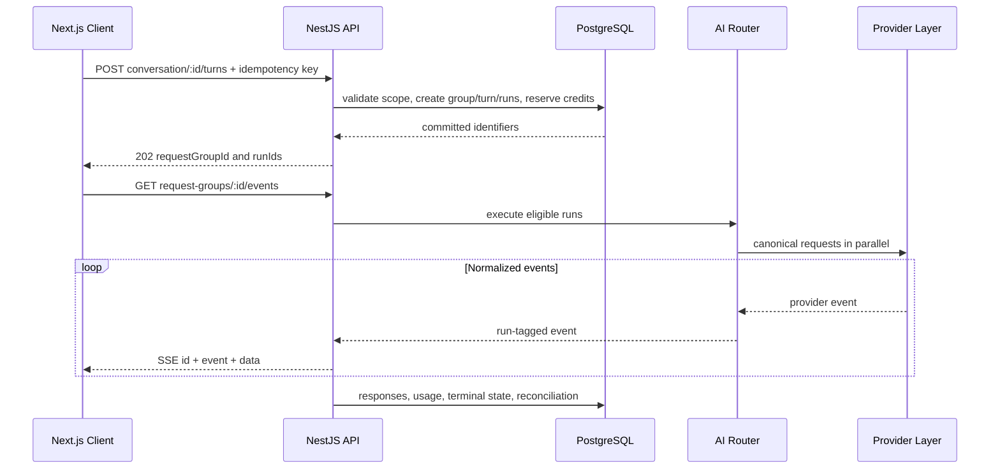
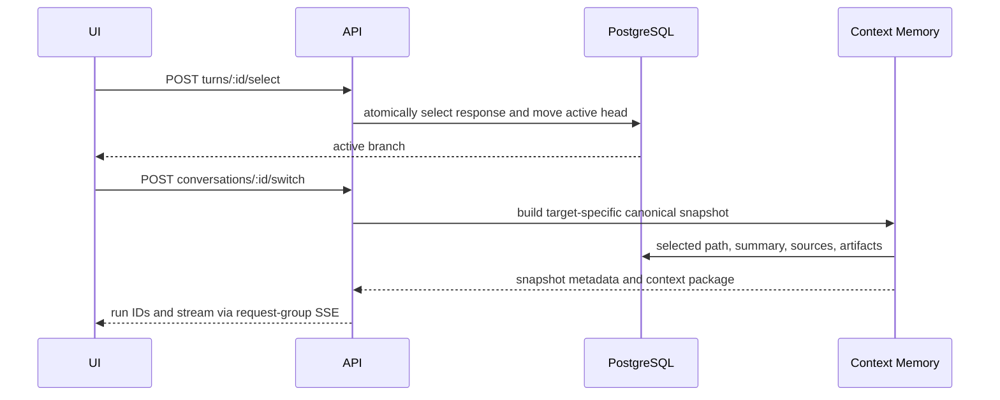

# API Design

#architecture #backend

## Purpose

Use REST for authenticated commands and server-sent events for mostly one-way, multiplexed provider output. WebSockets remain deferred until a bidirectional low-latency mode requires them.

## Contract

| Method | Endpoint | Purpose |
|---|---|---|
| `POST` | `/v1/conversations` | create a conversation with mode/providers |
| `GET` | `/v1/conversations` | list non-archived conversations in the active workspace |
| `GET` | `/v1/conversations/:id` | get provider-neutral turns, responses, runs, and routing metadata |
| `PATCH` | `/v1/conversations/:id` | rename a conversation |
| `DELETE` | `/v1/conversations/:id` | archive a conversation (soft delete) |
| `POST` | `/v1/conversations/:id/turns` | create one turn and one or more runs |
| `POST` | `/v1/conversations/:id/turns/:turnId/regenerate` | create a sibling turn from a prior user message |
| `POST` | `/v1/model-responses/:id/try-another` | run an unused enabled model against the same turn and canonical context |
| `GET` | `/v1/models` | list enabled, versioned model-registry metadata |
| `POST` | `/v1/request-groups/:id/routing-decision` | persist an authorized deterministic router decision |
| `GET` | `/v1/request-groups/:id/events` | SSE multiplex, reconnect via `Last-Event-ID` |
| `POST` | `/v1/turns/:id/select` | activate a candidate and move the head |
| `POST` | `/v1/conversations/:id/switch` | validate target and run with a context snapshot |
| `POST` | `/v1/model-runs/:id/cancel` | cancel one run only |
| `POST` | `/v1/files` | upload and synchronously extract an MVP text file |
| `POST` | `/v1/memories/preferences` | store a workspace rule or user preference |
| `GET` | `/v1/usage` | wallet, estimates, ledger, and actual usage summaries |
| `GET` | `/v1/auth/google` | begin Google authorization-code flow |
| `GET` | `/v1/auth/google/callback` | verify identity and create a durable session |
| `GET` | `/v1/auth/me` | return the authenticated user and workspace |
| `POST` | `/v1/auth/logout` | revoke the current session |

## Compare request flow

## Selection and switch flow

## Inputs and outputs

All mutations use validated versioned DTOs, authenticated workspace scope, and idempotency where replay is possible. SSE events have monotonically increasing IDs, run ID, normalized type, and typed payload.

## MVP implementation

The current conversation implementation returns `201` after the durable request
group, turn, routing decision, runs, and context snapshots have committed. The
browser then opens the request-group SSE endpoint. It receives `run.status`,
`content.delta`, and `run.error`; the API closes the stream on a terminal run
and the client refreshes its provider-neutral durable representation. The
short replay window is in process for local development only; PostgreSQL is
always the canonical source for terminal state and message content.

`POST /v1/model-responses/:id/try-another` adds a model run to the response's
existing request group rather than creating another user turn. It excludes the
source and already-used model keys by default (or validates an optional
`modelKey`), records the candidate in the routing decision, and creates a
separate immutable context snapshot for the same canonical branch. Completion
does not move the active head. `POST /v1/turns/:id/select` atomically chooses
one durable response, moves the conversation head, and stores a
`SWITCH_COHERENCE` feedback record; unselected alternatives remain visible.

`Idempotency-Key` is required on turn and regeneration commands. All mutable
endpoints require the existing authenticated session, same-origin request, and
CSRF header. `/v1/models` returns registry metadata rather than SDK-specific
model conditionals.

For the MVP, `POST /v1/files` accepts a text file body (`originalName`,
optional `mime`, and `content`) and synchronously extracts/chunks it. It is a
deliberately small local-development upload path; signed object uploads and
asynchronous processors remain deferred. The endpoint returns durable file
metadata only after chunks and their embeddings are stored.

## Failure behavior

Return stable normalized errors. A disconnected client replays within [[Redis|the retention window]] or fetches durable state. Cancelling one run does not cancel its request group.

## Security and scalability

Validate schemas/content types/sizes, authorize resources, rate-limit cost-bearing commands, use short-lived signed uploads, and avoid content in routine logs. Bound SSE buffers and connection counts; persist terminal state independently of a connection.

## Related notes

[[Frontend]] · [[Backend]] · [[AI-Router]] · [[Testing]] · [[Security]]

## Open Questions

- Does turn creation return `201` or `202`, and when is SSE subscription guaranteed ready?
- What event-retention duration and event-ID scope support reconnect?
