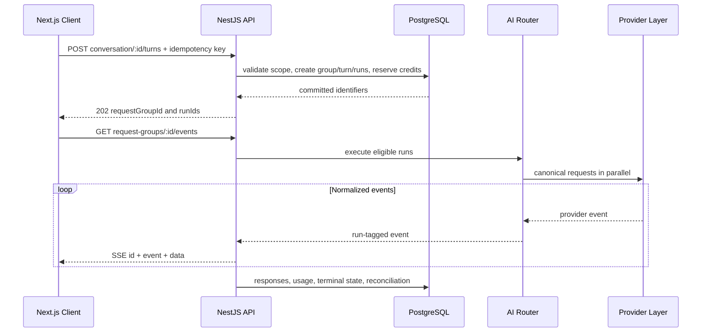
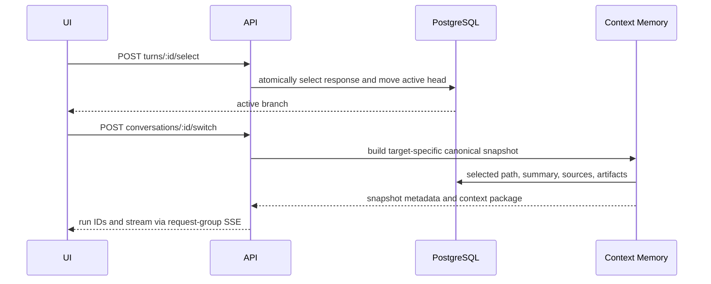

# API Design

#architecture #backend

## Purpose

Use REST for authenticated commands and server-sent events for mostly one-way, multiplexed provider output. WebSockets remain deferred until a bidirectional low-latency mode requires them.

## Contract

| Method | Endpoint | Purpose |
|---|---|---|
| `POST` | `/v1/conversations` | create a conversation with mode/providers |
| `POST` | `/v1/conversations/:id/turns` | create one turn and one or more runs |
| `GET` | `/v1/request-groups/:id/events` | SSE multiplex, reconnect via `Last-Event-ID` |
| `POST` | `/v1/turns/:id/select` | activate a candidate and move the head |
| `POST` | `/v1/conversations/:id/switch` | validate target and run with a context snapshot |
| `POST` | `/v1/model-runs/:id/cancel` | cancel one run only |
| `POST` | `/v1/files` | create signed upload intent; process asynchronously |
| `GET` | `/v1/usage` | wallet, estimates, ledger, and actual usage summaries |

## Compare request flow

## Selection and switch flow

## Inputs and outputs

All mutations use validated versioned DTOs, authenticated workspace scope, and idempotency where replay is possible. SSE events have monotonically increasing IDs, run ID, normalized type, and typed payload.

## Failure behavior

Return stable normalized errors. A disconnected client replays within [[Redis|the retention window]] or fetches durable state. Cancelling one run does not cancel its request group.

## Security and scalability

Validate schemas/content types/sizes, authorize resources, rate-limit cost-bearing commands, use short-lived signed uploads, and avoid content in routine logs. Bound SSE buffers and connection counts; persist terminal state independently of a connection.

## Related notes

[[Frontend]] · [[Backend]] · [[AI-Router]] · [[Testing]] · [[Security]]

## Open Questions

- What authentication/session endpoints and exact error envelope are used?
- Does turn creation return `201` or `202`, and when is SSE subscription guaranteed ready?
- What event-retention duration and event-ID scope support reconnect?
