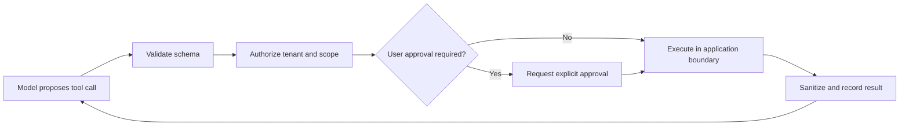

# Security

#security #architecture

## Purpose

Protect a widened multi-provider data boundary across identity, tenants, prompts, files, tools, provider secrets, costs, retention, and model output.

## Controls

| Risk | Required control |
|---|---|
| prompt injection in files/retrieval | treat content as untrusted, isolate instructions, allowlist tools |
| sensitive data sent to providers | explicit provider choice, privacy notice, optional redaction, fallback opt-in |
| provider key exposure | server-only secrets, per-environment keys, rotation, spend limits, redacted logs |
| cross-tenant access | workspace scope on every query/object key, short signed URLs, deny by default |
| improper output handling | sanitize Markdown/HTML, sandbox code, validate tools, never execute model text |
| unbounded consumption | rate/budget/output/file/concurrency limits, reservations, circuit breakers |
| retention mismatch | document provider/app terms, export/delete, deletion-state audit |
| supply-chain compromise | lockfiles, signed builds, scans, SBOM, minimal images, patch workflow |

## Tool execution boundary

Models never receive direct database or cloud credentials.

## Minimum production checklist

- HttpOnly, Secure, SameSite cookies; CSRF protection where necessary; short rotating sessions.
- OAuth authorization-code flow uses state, nonce, and S256 PKCE; only keyed
  opaque-session hashes are persisted. See [[Authentication]].
- Schema, content-type, and size validation at every API boundary.
- Workspace authorization before database, object, provider, and export access.
- Audit login, file access, provider switch, tool execution, credit adjustment, export, and deletion.
- Exclude raw prompt/response content from routine logs.
- Review threats against current OWASP GenAI risks before launch.

## Dependencies and data used

[[Backend]], [[API-Design]], [[Context-Memory]], [[Provider-Layer]], [[Credits-Billing]], [[Docker]], and [[Deployment]].

## Failure behavior

Deny on uncertain authorization, capability, credits, tool scope, or scan status. Security telemetry must avoid leaking the protected content.

## Scalability considerations

Centralize policy enforcement, cache only versioned authorization-safe decisions, automate key rotation/scanning, and apply rate limits per user/workspace/provider.

## Open Questions

- What retention defaults and provider-specific disclosures apply at launch?
- Which malware scanner, content controls, redaction rules, and moderation policy are required?
- What roles exist beyond workspace owner, and when do team permissions enter scope?
