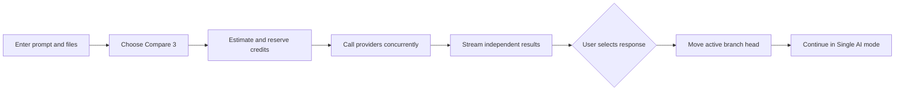
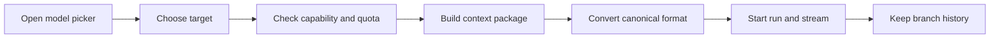

# User Flows

#product #frontend

## Compare, select, continue

One user turn creates multiple uniquely identified [[Provider-Layer|provider runs]] in a shared request group. Candidates remain saved; selecting one response moves the active branch exactly once. Users may select as soon as one response completes.

## Switch provider

The model picker presents capability, availability, estimated credits, and context readiness. [[Context-Memory]] sends the selected path, pinned memory, relevant history, summary, and current artifacts—not every rejected candidate.

## Partial failure and recovery

- Preserve successful and partial responses when another provider fails.
- Offer retry per provider and show normalized error/retry state.
- Release a reservation when failure occurs before meaningful output.
- Reconcile actual billable usage when partial output exists.
- Never send a private prompt to a fallback provider without opt-in.

## Capability-aware task change

For images, PDFs, tools, current-information search, or long context, rank eligible models using [[Model-Registry]]. Do not force an automatic choice. Tool side effects require validated scope and user approval; see [[Security]].

## UX constraints

Mobile comparison uses tabs, horizontal swiping, position indicators, and a sticky selection action—not three narrow columns. Every answer shows the active provider/model and switches show a context-handoff indicator.

## Related notes

[[Frontend]] · [[AI-Router]] · [[API-Design]] · [[Credits-Billing]] · [[Product-Vision]]

## Open Questions

- Can a user cancel unselected in-flight runs immediately after choosing a winner, and what charge policy applies?
- Does changing an earlier selection merely reactivate a stored path or always create a new branch identity?
